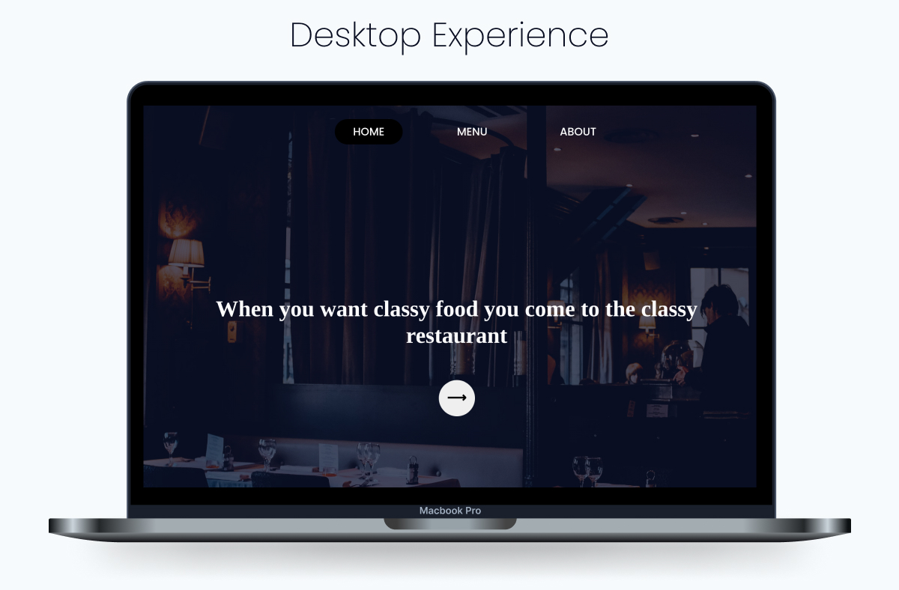
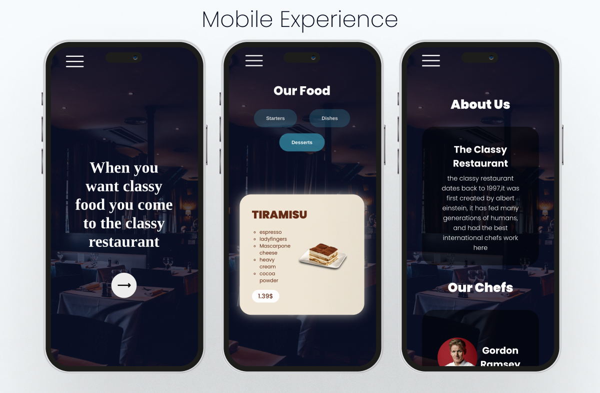

# Restaurant

##### this is simple design for a restaurant page, completely generated by javascript modules, had a lot of fun making it and learned many things from module bundling to advanced css (responsiveness, transitions, animations) and css loaders also. I followed a mobile first approach when designing hte website.

##### LIVE PREVIEW : https://somehowalive.github.io/Restaurant/

### Features

-   reponsiveness 100%
-   food dishes and started are generated from a json file.
-   horizontal card scrolling on mobile.
-   dynamic loading of elements.

### Dekstop Preview

### Mobile Preview

